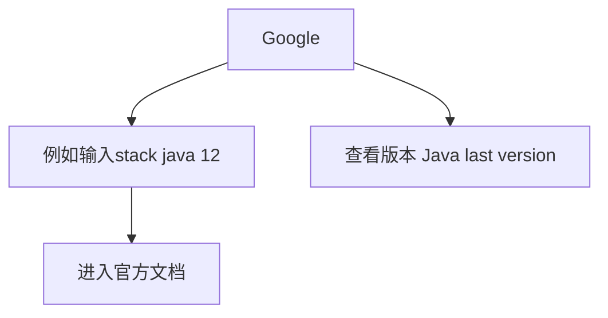

学习笔记
# 1. 数组 Array
## 1.1 基本特性
* 由于顺序存储的原因查找元素速度非常快
* insert和delete操作都需要移动数组元素
* 平均每移动一个元素需要移动整个数组一半的元素
* 时间复杂度
  perpend -> O(1)
  append -> O(1)
  **lookup -> O(1)**
  insert -> O(n)
  delete -> O(n)
# 2. 链表 List
## 2.1 基本特性
* 时间复杂度
  perpend -> O(1)
  append -> O(1)
  **lookup -> O(n)**
  insert -> O(1)
  delete -> O(1)
## 2.2 分类
* 单链表
* 双向链表
* 循环链表
## 2.3 源码分析
* Java 1.8 ArrayList（重点在于grow()函数）
    
  ``` java
    /**
     * Appends the specified element to the end of this list.
     *
     * @param e element to be appended to this list
     * @return <tt>true</tt> (as specified by {@link Collection#add})
     */
    public boolean add(E e) {
        ensureCapacityInternal(size + 1);  // Increments modCount!!
        elementData[size++] = e;
        return true;
    }
  ```

  ```java
    /**
     * Inserts the specified element at the specified position in this
     * list. Shifts the element currently at that position (if any) and
     * any subsequent elements to the right (adds one to their indices).
     *
     * @param index index at which the specified element is to be inserted
     * @param element element to be inserted
     * @throws IndexOutOfBoundsException {@inheritDoc}
     */
    public void add(int index, E element) {
        rangeCheckForAdd(index);

        ensureCapacityInternal(size + 1);  // Increments modCount!!
        System.arraycopy(elementData, index, elementData, index + 1,
                         size - index);
        elementData[index] = element;
        size++;
    }
  ```

  ```java
    private static int calculateCapacity(Object[] elementData, int minCapacity) {
        if (elementData == DEFAULTCAPACITY_EMPTY_ELEMENTDATA) {
            return Math.max(DEFAULT_CAPACITY, minCapacity);
        }
        return minCapacity;
    }

    private void ensureCapacityInternal(int minCapacity) {
        ensureExplicitCapacity(calculateCapacity(elementData, minCapacity));
    }

    private void ensureExplicitCapacity(int minCapacity) {
        modCount++;

        // overflow-conscious code
        if (minCapacity - elementData.length > 0)
            grow(minCapacity);
    }
    /**
     * The maximum size of array to allocate.
     * Some VMs reserve some header words in an array.
     * Attempts to allocate larger arrays may result in
     * OutOfMemoryError: Requested array size exceeds VM limit
     */
    private static final int MAX_ARRAY_SIZE = Integer.MAX_VALUE - 8;

    /**
     * Increases the capacity to ensure that it can hold at least the
     * number of elements specified by the minimum capacity argument.
     *
     * @param minCapacity the desired minimum capacity
     */
    private void grow(int minCapacity) {
        // overflow-conscious code
        int oldCapacity = elementData.length;
        int newCapacity = oldCapacity + (oldCapacity >> 1);
        if (newCapacity - minCapacity < 0)
            newCapacity = minCapacity;
        if (newCapacity - MAX_ARRAY_SIZE > 0)
            newCapacity = hugeCapacity(minCapacity);
        // minCapacity is usually close to size, so this is a win:
        elementData = Arrays.copyOf(elementData, newCapacity);
    }
  ```
# 3. 跳表 Skip List
## 3.1 基本特征
* 注意：只能用于元素有序的情况
* 跳表（skip list）对标的是平衡树（AVL Tree）和二分查找，是一种插入/删除/搜索都是O(long n)的数据结构。于1989年出现。
* 优势：原理简单、容易实现、方便扩展、效率更高。在一些热门的项目里用来代替平衡二叉树，如Redis、LevelDB等。
* 缺点：索引维护成本高，每添加或者删除一个节点都需要更新一遍索引
* 思维：升维思想 + 空间换时间
## 3.2 时间复杂度分析
* n/2、n/4、n/8、第k级索引结点的个数就是n/(2^k)
* 假设索引有h级，最高级的索引有2个节点。n/(2^h) = 2，从而求得h = log2(n) - 1
* 时间复杂度：O(long n)

# 3.3 空间复杂度分析
* 原始链表大小为n，每2个结点抽1个，每层索引的结点数：
$\frac{n}{2}$,$\frac{n}{4}$,$\frac{n}{8}$,...,8,4,2
* 原始链表大小为n，每3个结点抽1个，每层索引的结点数：
$\frac{n}{3}$,$\frac{n}{9}$,$\frac{n}{27}$,...,9,3,1
* 空间复杂度：O(n)

详细可以参考维基百科：https://zh.wikipedia.org/wiki/%E8%B7%B3%E8%B7%83%E5%88%97%E8%A1%A8#%E5%AE%9E%E7%8E%B0%E7%BB%86%E8%8A%82

## 4. 数组、链表、跳表对比
|         | 时间复杂度   |  空间复杂度  |
| --------   | -----:   | :----:  |
| 数组        | O(n)     |   O(n)     |
| 链表        |   O(n)   |   O(1)   |
| 跳表        |    O(long n)    |  O(n)  |

## 5. 栈
### 5.1 基本特征
* 先进后出（FILO）
* 插入和删除操作：O(1)
* 取出操作：O(n)
### 5.2 示例
```java
    Stack<Integer> stack = new Stack<>();
    stack.push(1);
    stack.push(2);
    stack.push(3);
    stack.push(4);
    System.out.println(stack);
    System.out.println(stack.search(4));

    stack.pop();
    stack.pop();
    Integer topElement = stack.peek();
    System.out.println(topElement);
    System.out.println("3的位置" + stack.search(3));
```
## 6. 队列
### 6.1 基本特征
* 先进先出（FIFO）
* 插入和删除操作：O(1)
* 取出：O(n)
### 6.2 示例
```java
    Queue<String> queue = new LinkedList<String>();
    queue.offer("one");
    queue.offer("two");
    queue.offer("three");
    queue.offer("four");
    System.out.println(queue);

    String polledElement = queue.poll();
    System.out.println(polledElement);
    System.out.println(queue);

    String peekedElement = queue.peek();
    System.out.println(peekElement);
    System.out.println(queue);

    while(queue.size() > 0) {
        System.out.println(queue.poll());
    }
```
### 6.2 双端队列 Deque
* 简单理解：两端可以进出的Queue
* 插入和删除都是O(1)操作
旧示例代码：
```java
    Deque<String> deque = new LinkedList<String>();

    deque.push("a");
    deque.push("b");
    deque.push("c");
    System.out.println(deque);

    String str = deque.peek();
    System.out.println(str);
    System.out.println(deque);

    while (deque.size() > 0) {
        System.out.println(deque.pop());
    }
    System.out.println(deque);
```

改写示例代码：
```java
    Deque<String> deque = new LinkedList<String>();

    deque.addFirst("a");
    deque.addFirst("b");
    deque.addFirst("c");
    deque.addLast("d");
    deque.addLast("e");
    deque.addLast("f");
    System.out.println(deque);

    String str = deque.peek();
    System.out.println(str);
    System.out.println(deque);

    while (deque.size() > 0) {
        System.out.println(deque.remove());
    }
    System.out.println(deque);
```

源码：
LinkedList本身实现了Deque接口，Node类拥有前后指针
```java
    private static class Node<E> {
        E item;
        Node<E> next;
        Node<E> prev;

        Node(Node<E> prev, E element, Node<E> next) {
            this.item = element;
            this.next = next;
            this.prev = prev;
        }
    }
```

```java
     /**
     * Inserts the specified element at the beginning of this list.
     *
     * @param e the element to add
     */
    public void addFirst(E e) {
        linkFirst(e);
    }

    /**
     * Appends the specified element to the end of this list.
     *
     * <p>This method is equivalent to {@link #add}.
     *
     * @param e the element to add
     */
    public void addLast(E e) {
        linkLast(e);
    }

    /**
     * Links e as first element.
     */
    private void linkFirst(E e) {
        final Node<E> f = first;
        final Node<E> newNode = new Node<>(null, e, f);
        first = newNode;
        if (f == null)
            last = newNode;
        else
            f.prev = newNode;
        size++;
        modCount++;
    }

    /**
     * Links e as last element.
     */
    void linkLast(E e) {
        final Node<E> l = last;
        final Node<E> newNode = new Node<>(l, e, null);
        last = newNode;
        if (l == null)
            first = newNode;
        else
            l.next = newNode;
        size++;
        modCount++;
    }
```

```java
    /**
     * Removes and returns the first element from this list.
     *
     * @return the first element from this list
     * @throws NoSuchElementException if this list is empty
     */
    public E removeFirst() {
        final Node<E> f = first;
        if (f == null)
            throw new NoSuchElementException();
        return unlinkFirst(f);
    }

    /**
     * Removes and returns the last element from this list.
     *
     * @return the last element from this list
     * @throws NoSuchElementException if this list is empty
     */
    public E removeLast() {
        final Node<E> l = last;
        if (l == null)
            throw new NoSuchElementException();
        return unlinkLast(l);
    }
    
    /**
     * Unlinks non-null first node f.
     */
    private E unlinkFirst(Node<E> f) {
        // assert f == first && f != null;
        final E element = f.item;
        final Node<E> next = f.next;
        f.item = null;
        f.next = null; // help GC
        first = next;
        if (next == null)
            last = null;
        else
            next.prev = null;
        size--;
        modCount++;
        return element;
    }

    /**
     * Unlinks non-null last node l.
     */
    private E unlinkLast(Node<E> l) {
        // assert l == last && l != null;
        final E element = l.item;
        final Node<E> prev = l.prev;
        l.item = null;
        l.prev = null; // help GC
        last = prev;
        if (prev == null)
            first = null;
        else
            prev.next = null;
        size--;
        modCount++;
        return element;
    }
```

### 6.3 优先队列 Priority Queue
* 插入操作：O(1)
* 取出操作：O(longN) - 按照元素的优先级取出
* 底层具体实现的数据结构较为多样和复杂：heap、bst、treap

源码：
通过数组拷贝来扩容，实现Comparator接口来比较元素，使用时必须实现comparatorTo方法。
```java
    /**
     * Inserts the specified element into this priority queue.
     *
     * @return {@code true} (as specified by {@link Queue#offer})
     * @throws ClassCastException if the specified element cannot be
     *         compared with elements currently in this priority queue
     *         according to the priority queue's ordering
     * @throws NullPointerException if the specified element is null
     */
    public boolean offer(E e) {
        if (e == null)
            throw new NullPointerException();
        modCount++;
        int i = size;
        if (i >= queue.length)
            grow(i + 1);
        size = i + 1;
        if (i == 0)
            queue[0] = e;
        else
            siftUp(i, e);
        return true;
    }
```

```java
    /**
     * The maximum size of array to allocate.
     * Some VMs reserve some header words in an array.
     * Attempts to allocate larger arrays may result in
     * OutOfMemoryError: Requested array size exceeds VM limit
     */
    private static final int MAX_ARRAY_SIZE = Integer.MAX_VALUE - 8;

    /**
     * Increases the capacity of the array.
     *
     * @param minCapacity the desired minimum capacity
     */
    private void grow(int minCapacity) {
        int oldCapacity = queue.length;
        // Double size if small; else grow by 50%
        int newCapacity = oldCapacity + ((oldCapacity < 64) ?
                                         (oldCapacity + 2) :
                                         (oldCapacity >> 1));
        // overflow-conscious code
        if (newCapacity - MAX_ARRAY_SIZE > 0)
            newCapacity = hugeCapacity(minCapacity);
        queue = Arrays.copyOf(queue, newCapacity);
    }
```

```java
      /**
     * Inserts item x at position k, maintaining heap invariant by
     * promoting x up the tree until it is greater than or equal to
     * its parent, or is the root.
     *
     * To simplify and speed up coercions and comparisons. the
     * Comparable and Comparator versions are separated into different
     * methods that are otherwise identical. (Similarly for siftDown.)
     *
     * @param k the position to fill
     * @param x the item to insert
     */
    private void siftUp(int k, E x) {
        if (comparator != null)
            siftUpUsingComparator(k, x);
        else
            siftUpComparable(k, x);
    }

    @SuppressWarnings("unchecked")
    private void siftUpComparable(int k, E x) {
        Comparable<? super E> key = (Comparable<? super E>) x;
        while (k > 0) {
            int parent = (k - 1) >>> 1;
            Object e = queue[parent];
            if (key.compareTo((E) e) >= 0)
                break;
            queue[k] = e;
            k = parent;
        }
        queue[k] = key;
    }

    @SuppressWarnings("unchecked")
    private void siftUpUsingComparator(int k, E x) {
        while (k > 0) {
            int parent = (k - 1) >>> 1;
            Object e = queue[parent];
            if (comparator.compare(x, (E) e) >= 0)
                break;
            queue[k] = e;
            k = parent;
        }
        queue[k] = x;
    }
```
## 7. 如何查询接口信息？如何使用？

## 8. 本周学习感想
主要是学习方法的改变，高效的学习方法事半功倍，把五毒神掌的学习方法融会贯通到学习工作中。
